# 三级

## 1.1. 产品及服务品类信息优化

- 关键字字段：输入型，关键词判断，顺序无关

## 1.2. 产品及服务组合信息管理

普通商品/服务商品：

1. 关键字字段：输入型，关键词判断，顺序无关
2. 文字：删除‘开关‘字样，‘开启/关闭’改为‘显示/不显示’

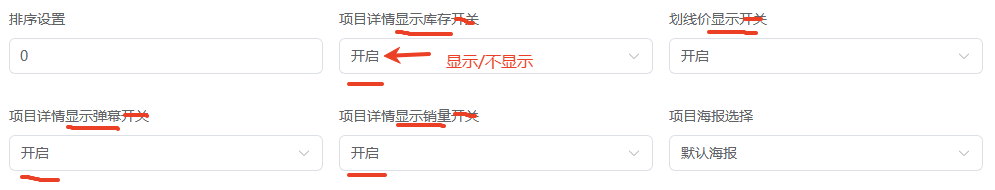

## 1.3. 产品及服务价格信息管理

### 考评端：

- M7/M8：自动获取组合商品中价格较大的那项；
- M9/M10: 自动获取组合商品中价格较小的那项；
- M8/M10：增加名称的显示和判断（添加答案处也增加“名称”）

## 2.1. 店铺整体风格及元素和页面设计制作

### 管理端/评委端

- M1-M17：系统评分
- M15/M16：5套题的任务、素材、答案都不一致

### 考生端：

- 手机首页/PC端首页/详情页首页，菜单无法切换
- 浮层：

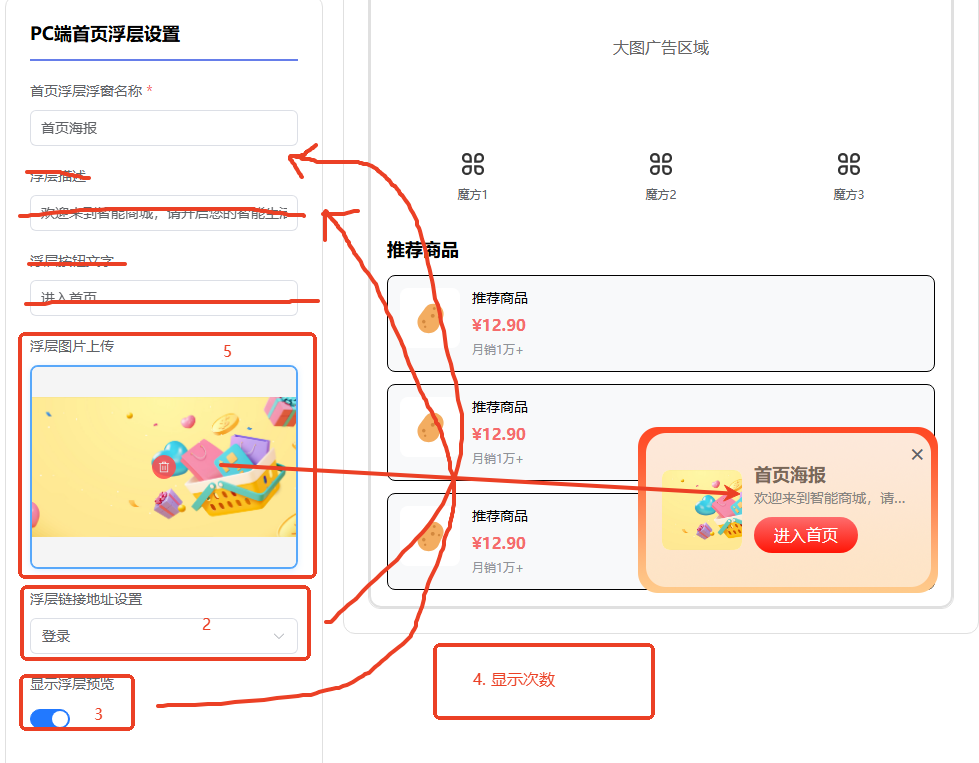

- 详情页：

不用提示数量和分辨率，只呈现图片上传按钮即可，文字改成“详情描述”

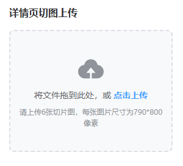

## 3.1. 搜索引擎推广

### 考生端：

- 除商品名称、关键词、促销语字段外，其他字段不允许编辑

### 管理端/考评端：

- M2/M4：系统评分，全匹配
- M3关键词：输入型，关键词判断，顺序无关

## 3.2. 网店信息流推广

### 管理端/考评端：

- *M1-M11*：
  1. 呈现文档内容；
  2. 进行文字/关键词匹配；
  3. 高亮关键词；
  4. 系统评分？

## 4.1. 商品补货与采购管理

*数据操作逻辑要大改*

## 4.2. 基于交易信息的客户管理与销售数据分析

### 管理端：

- 素材上传漏了一列，*英文翻译为中文*
- *1、2、4、5中评；3差评；*

## 5.1. 进行秒杀社群的管理

- M2: 改为系统评分，使用多个评分点
- M8：改为系统评分
- M9: 是不是设置成一个组下面的多个评分点会好一点？

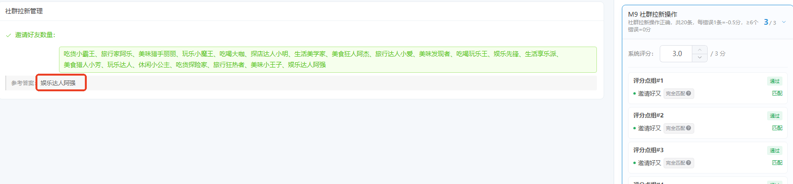

- 1

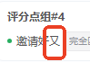

## 5.2. 提升客户忠诚度和挽回率

### 管理端/考评端：

- M1：因考生端都是选择，考虑改成系统评分
- M3：

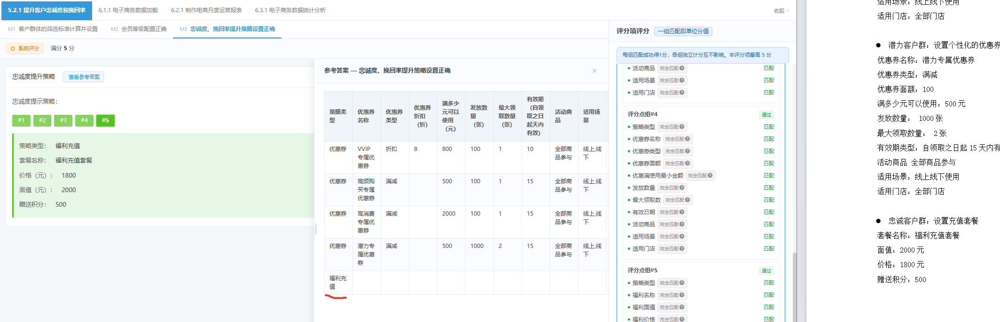

## 6.1. 电子商务数据加载

### 管理端/考评端：

- M1：

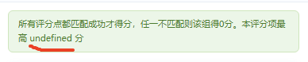

- M2-M14：全部改为系统评分
  - *M2~M5全对的情况下，M6默认匹配成功。*
  - *M2、M7-M9全对的情况下，M10默认匹配成功。*
  - *M2、M11-M13全对的情况下，M14默认匹配成功。*
  - M6\\M10\\M14，直接渲染图表出来
  - M3、M7、M11：都改为中文

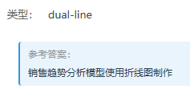

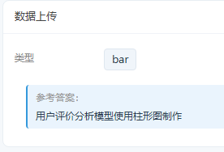

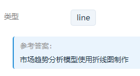

## 6.2. 制作电商月度运营报表

### 管理端/考评端：

- M20：直接渲染出来

## 6.3. 电子商务数据统计分析

- *M4/M8/M12：评分表多一个字*

## 总（含4级）

- *部分评分组改成表格统一呈现*

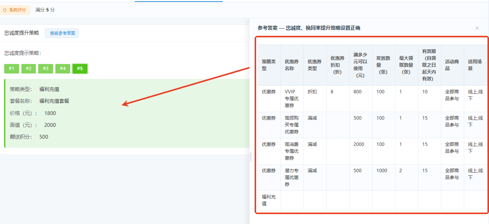
