# 四级

## 1.1 图文资料采编

### M1

1. **商品标签**：输入型，关键词判断，顺序无关
2. **关键词**：输入型，关键词判断，顺序无关

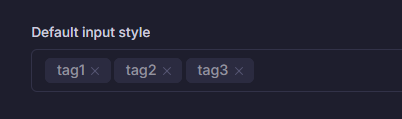

1. **配置-销售渠道**：选择型，关键词判断，顺序无关
2. **配置-配送方式**：选择型，关键词判断，顺序无关
3. **配置-重量**：1.1.1 注意克重

### M2

- **关键词**：输入型，关键词判断，顺序无关

### M3

- **配置-关键词判断**：输入型，关键词判断，顺序无关

## 1.2 视频拍摄与处理

*考虑统一呈现*

- M1-M8: 输入型，关键词判断，**评委端呈现所有沟通内容，匹配上时高亮显示**

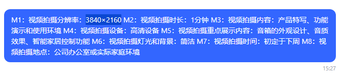

- M9（剪辑时长）: 系统判断
- *J1：可能缺失工作方案模块。暂时使用沟通内容*

## 2.1 装修元素制作

- **M1**: 管理端设置：输入型，关键词判断；**考评端在匹配上关键词时对关键词进行高亮**

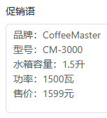

- **M3**: 调取主图的分辨率进行系统判断

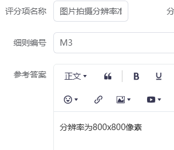

- **M4**: 系统判断时长和分辨率的匹配情况，配音、有字幕需要人工判断（评委端匹配标签底色为黄色、人工审核）

## 2.2 用户页面装修

- M1-M10: 获取指定区域的内容是否已设置
- J1: 全部呈现

## 3.1 网店促销

## 3.2 电商平台活动实施

有坑，每个题的M项都不一样

- **3.2.1** 题目里没有价格

## 3.3 网络直播推广

- **M2**: 标签输入型，关键词判断，顺序无关

- **M3**: 考生端时间选择不方便, 且得分改为系统判断
- **M4**: 考生端用标签/复选形式，而不是单选, 关键词判断，顺序无关

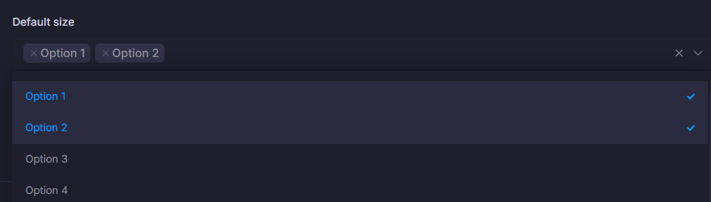

- **M5**: 选择型，关键词判断，顺序无关

## 4.1 商品管理

- **M6\\M7**: 输入型，关键词判断，顺序无关

- 考生端商品详情图上传——统一上传按钮

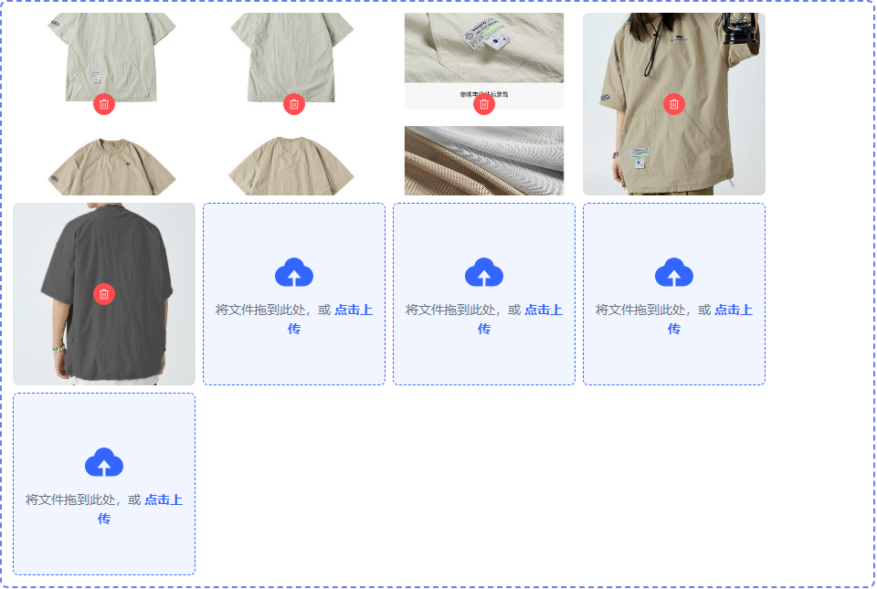

- 考生端列表页的操作页呈现一致：都有上下架功能，系统素材的编辑按钮不可点

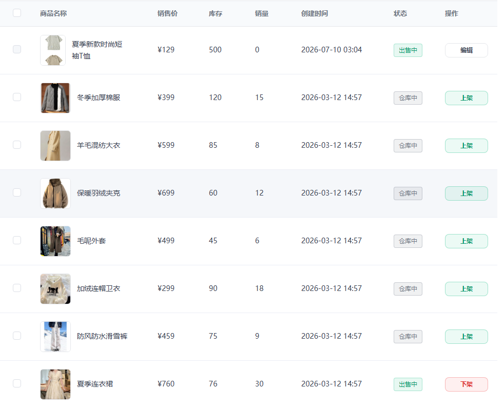

## 4.2 订单管理

### 考生端：

- 退货时出现多个店铺地址，根据题目提供的店名选择地址。审核时不出现“~~退货入库数量~~”

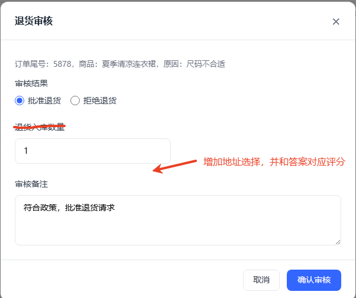

- 增加退款流程（M7-M9）：确认审核后列表页出现新的按钮——“退款处理”，点击后模态框出现“*商品状态*”和“*商品数量*”字样。呈现”退货入库数量“输入框，确认后完成退款入库操作。

- 换货时也把审核（M10-M12）和换货(M13\\M14)操作分开，以下3个字段挪到换货操作上，换货时的提示词增加“*商品状态*”和“*商品数量*”字样。

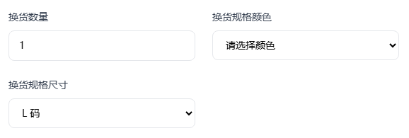

## 5.1 智能客服训练

- 答案配置：3个M项都重新配置为系统评分，按评分点全匹配，然后提示评委重点看有误的是否真的有误

## 5.2 客户关系维护

## 6.1 电子商务数据采集与清洗

- *M1-M8: 需要重新整理成系统评分-评分点组的方式*
- M9: 后台答案设置需要处理的产品ID，评分时调取相应的产品ID行，检查所有字段的数据是否存在

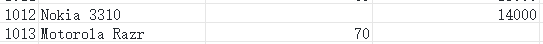

- M10: 后台答案设置产品ID，评分时调取相应的产品ID条数是否大于1

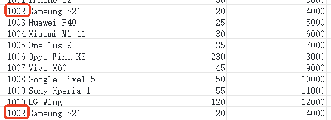

- M13: 考生端上传时获取包含扩展名的文件名，评委端直接呈现完整文件名，并自动判断。
